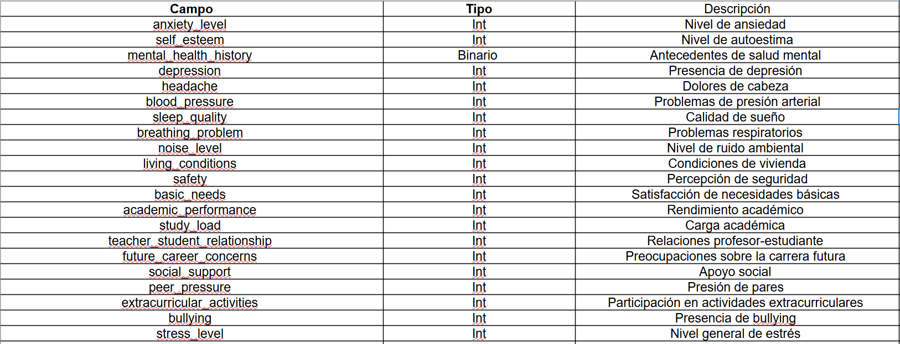

# Proyecto-pagina-web
Integrantes: Rodrigo Venegas, Benjamin Iribarren

# Descripcion
La pagina realizada para este proyecto constara de un inicio donde el usuario se registrara con su nombre y su rut,
despues se le mostrara una serie de preguntas para que responda relacionado a si ha tenido algun problema de salud mental en algun momento de su vida
se le mostrara unas metricas en base a un dataset y por ultimo se le mostrara una serie de especialistas donde el podra escojer a alguno para fijar una cita 
o una actividad para aliviar su situacion actual

# Instrucciones

1.- escribir su nombre y rut en los bloques que se muestran correspondientemente

2.- responder las preguntas segun lo que usted sienta en ese momento

3.- seleccionar un especialista, si no lo ve necesario, ver alguna recomendacion de actividades para la relajacion

## Problema a Resolver
Actualmente no existen suficientes herramientas digitales simples para analizar datos de **estrés en estudiantes** y clasificarlos según factores de salud mental.  
Esto dificulta la gestión y clasificación de los casos para una **intervención temprana en situaciones de riesgo psicológico**.

## Usuarios Afectados
Estudiantes, psicólogos, orientadores académicos e instituciones educativas.
 

## Necesidad Actual
Contar con una **plataforma que centralice la información de estrés**, la clasifique y permita una **exploración rápida** para apoyar la intervención de un profesional.

## Objetivo Principal
Desarrollar un sistema web de análisis exploratorio que clasifique a estudiantes según niveles de estrés y factores asociados para apoyar gestión de pacientes para profesionales de la salud mental.
  

## Alcances y Fuera de Alcance

### Alcances
- Cargar y procesar datasets.  
- Visualizar estadísticas exploratorias (gráficos, distribuciones).  
- Clasificar estudiantes según variables de estrés y diagnóstico.  
- Consultar información de los usuarios.  

### Fuera de Alcance
- No se realizará un diagnóstico médico real, solo una clasificación de casos.  
- No se generarán predicciones.  
- No incluye historial clínico ni seguimiento a largo plazo.  

## Paradigmas de Programación

### Programación Orientada a Objetos (POO)  
Lo utilizaremos para modelar entidades como Usuarios, Pacientes,Consulta con atributos (edad, género, diagnóstico) y métodos (clasificar, mostrar estadísticas).  

### Programación Funcional  
Para operaciones matemáticas y transformar datos.

La necesidad de usar estos paradigmas se justifica con el dominio del problema, el cual requiere objetos (usuarios, diagnósticos) y, a la vez, operaciones puras sobre datos para análisis y  clasificación.

## Dataset

- **Nombre del dataset:** Student Stress Monitoring Datasets (Kaggle).  
- **Origen:** Subido por *Md Sultanul Islam Ovi* en la plataforma Kaggle.  
- **Tamaño:** 2 archivos CSV  
  - Primer archivo: 21 filas y 1000 columnas.  
  - Segundo archivo: 26 filas y 843 columnas.  
- **Licencia:** Licencia pública de Kaggle (Apache Licence, versión 2.0).  
- **Tipos de datos:** El repositorio indica que los datos son reales y fueron recopilados de una encuesta dirigida a estudiantes a lo largo del mundo, con fines de investigación.  

El dataset nos proporciona dos archivos CSV: **StressLevelDataset.csv** y **Stress_Dataset.csv**.  
Para este proyecto nos enfocaremos en **StressLevelDataset**, ya que contiene información sobre **factores psicológicos, académicos y sociales** que influyen en los estudiantes.  

Este archivo incluye variables relacionadas con **ansiedad, autoestima, depresión, calidad del sueño, presión académica, entre otros indicadores**, lo que permite **analizar y clasificar a los estudiantes según su nivel de estrés**.  
De esta manera, podemos identificar el **tipo y grado de estrés** que experimentan, facilitando la clasificación de su **estado de salud mental**.

### Dataset de niveles de estrés (StressLevelDataset)

